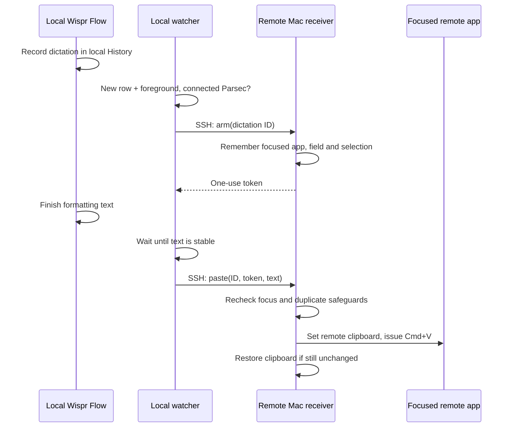

# Flow Remote Bridge

**Dictate locally with Wispr Flow. Paste into your remote Mac automatically.**

Flow can hear you, finish a transcription, and paste successfully into local apps—yet fail to insert anything into a remote desktop. Flow Remote Bridge handles that last step: it recognizes a new Flow dictation aimed at Parsec, sends the text over SSH, and performs a native **Cmd+V on the remote Mac**.

This is by no means meant for wide distribution but I wanted to share in case anyone else might find this useful.

No extra dictation shortcut. No manual clipboard juggling. No generic clipboard watcher.

> **Early public release.** The original implementation was tested with real dictation from both macOS and Windows 11 Parsec clients into a Mac host. This repository packages that implementation with configurable paths, installers, tests, and documentation. It depends on Wispr Flow's **undocumented local history schema**, so Flow updates may require changes. It is not an official Wispr or Parsec integration.

## What works today

| Local computer running Flow | Remote-desktop client | Destination | Status |
|---|---|---|---|
| macOS | Parsec | macOS | Live dictation verified in original deployment |
| Windows 11, with WSL available for SSH | Parsec | macOS | Live dictation verified in original deployment |
| Either client away from home | Parsec + reachable SSH host | macOS | Same transport design; Tailscale is optional |
| Screen Sharing, VNC, other clients | Adapter needed | macOS | Not implemented here |
| Any client | Any | Windows/Linux destination | Receiver not implemented |

The Mac receiver is independent of Parsec. The **client's foreground-app and connection checks** are Parsec-specific. That makes other remote tools plausible extensions, not supported configurations yet. See [adapting the bridge](docs/adapters.md).

## How it works



The bridge uses the actual Flow-targeted text, preferring `pastedText` over `formattedText`. Existing history is excluded at watcher startup. Ordinary clipboard copies and dictations into other local apps are not forwarded.

SSH carries JSON on standard input; dictation never becomes a shell command or command-line argument. Tailscale works well for reaching a home Mac from elsewhere, but ordinary trusted SSH connectivity works too. The receiver exposes only a per-user Unix socket, not another network service.

## Get started

You need:

- Wispr Flow running on the **local** Mac/Windows computer, with local history available.
- Parsec already working between the client and a logged-in remote Mac.
- Python 3 and Apple's Swift compiler on the remote Mac; also on a macOS client.
- Windows PowerShell 5.1 and WSL with OpenSSH on a Windows client. The watcher itself is native Windows; only SSH runs through WSL.
- An existing verified, noninteractive SSH login into the **same remote Mac user whose desktop you control**.
- Accessibility permission for the receiver, granted through macOS System Settings.

```sh
git clone https://github.com/carljborg/flow-remote-bridge.git
cd flow-remote-bridge
```

On the **remote Mac**, from its logged-in desktop session:

```sh
python3 scripts/install-macos.py receiver --start
```

Grant **Flow Remote Bridge** Accessibility in System Settings → Privacy & Security → Accessibility. Add `~/Applications/Flow Remote Bridge.app` if it is not listed. The installer does not grant permissions automatically.

On a **macOS client**:

```sh
python3 scripts/install-macos.py client
# Edit ~/.config/flow-remote-bridge/config.json with your SSH alias and a unique client ID.
python3 ~/.local/share/flow-remote-bridge/watch.py --health
launchctl bootstrap "gui/$(id -u)" "$HOME/Library/LaunchAgents/org.flowremotebridge.client.plist"
```

On a **Windows client**, in Windows PowerShell 5.1:

```powershell
.\scripts\install-windows.ps1
# Edit $env:LOCALAPPDATA\FlowRemoteBridge\config.json with your WSL user and SSH alias.
# Follow the SSH/health checks in docs/setup.md before enabling the task.
Enable-ScheduledTask -TaskName 'Flow Remote Bridge'
Start-ScheduledTask -TaskName 'Flow Remote Bridge'
```

Then connect with Parsec, click into a harmless text document on the remote Mac, and dictate normally. Keep the remote target unchanged. You may temporarily minimize Parsec and return; pending dictation waits for you. Test a short phrase first, then punctuation, non-English text, and a second dictation.

**Read the [complete setup and uninstall guide](docs/setup.md)** for SSH verification, configuration, health checks, autostart, logs, and updates.

## Optional macOS fix: stray `v` before dictation

If Parsec receives an extra `v` before otherwise successful dictation, see the
[optional Hammerspoon paste guard](extras/hammerspoon/README.md). It suppresses
Wispr's separate local synthetic paste attempt while the bridge delivers text
on the remote Mac. It is opt-in, requires client Accessibility access, and is
not a general keyboard remapper or a Windows fix.

## Safeguards and limits

- Only new, completed Flow records targeted at Parsec qualify.
- The local Parsec app must be connected and foreground when arming and delivering. Already-armed dictation pauses while you switch away; returning within 25 minutes of arming resumes delivery only if the original remote destination still passes validation. It never pastes while you remain in another local app.
- The receiver checks the remote app, window and focused element at arming and again before paste. Editor draft or selection changes cancel when exposed by Accessibility. Apple Terminal’s read-only terminal surface has a specific policy: streaming output and caret offsets may change, but selected text blocks delivery.
- ID journaling and one-use tokens prevent automatic replay of the same delivery. This is **at-most-once attempt behavior**, not guaranteed delivery.
- The helper does not send an Enter key. **Multiline text pasted into a terminal can nevertheless execute commands**, depending on the terminal/shell. Use a text editor for initial testing.
- The bridge does not record audio, read screenshots, or write transcript bodies to its own logs. Flow's own history and other clipboard managers are separate.
- Clipboard restoration is best-effort: if another app changes it, the bridge leaves the newer clipboard alone.
- There is **no remote peer identity check** in the current Parsec log adapter. Use a dedicated Parsec client connection to the configured SSH destination. Stop the watcher before connecting to another host.
- Concurrent remote users, apps with incomplete Accessibility support, changed Flow schemas, and clipboard races can prevent delivery. Do not use this to circumvent workplace data-transfer restrictions.

[Security and privacy](SECURITY.md) · [Troubleshooting](docs/troubleshooting.md) · [Protocol and architecture](docs/architecture.md)

## How we built it

This began with a real remote-work setup: Flow transcribed correctly on local Mac and Windows clients, manual copy/paste worked in Parsec, but Flow's automatic insertion did not. We inspected the installed app's local behavior and database schema, found app-targeted history records, and built a read-only watcher plus a native Mac paste receiver. We did not modify Wispr's application, inject code into it, or ship any of its binaries.

The first version was tested across both clients with Unicode text, focus-change rejection, duplicate rejection, and then actual spoken dictation. This public version replaces personal paths and hosts with configuration and adds installation and development tooling.

Read [the development story and tradeoffs](docs/development-story.md) for why we chose this approach over watching every clipboard change.

## Development

```sh
python3 -m unittest discover -s tests -v
# On macOS; builds without installing or granting permissions:
mkdir -p build
xcrun swiftc -swift-version 5 -O receiver/Receiver.swift -o build/FlowRemoteReceiver
build/FlowRemoteReceiver --test-field-policy
xcrun swiftc clients/macos/Frontmost.swift -o build/frontmost
```

Windows build/policy tests: `powershell -File tests/windows.ps1`.

GitHub Actions runs Python policy tests, Swift builds, and Windows compilation/policy tests. It cannot prove a real microphone → Flow → Parsec → Accessibility paste path; that remains a manual integration test. See [CONTRIBUTING.md](CONTRIBUTING.md).

## Credits and license

MIT licensed. Independently developed with assistance from OpenAI Codex.

- [Wispr's remote-desktop troubleshooting guide](https://docs.wisprflow.ai/articles/7336156466-use-flow-with-remote-desktops-citrix-rdp-vdi) documents the underlying class of insertion problems.
- [robertjordanjr/remote-wispr](https://github.com/robertjordanjr/remote-wispr) is a related Apple Screen Sharing reference implementation we encountered during research. It demonstrates another approach to bridging Flow history into a remote Mac; no code from it is included here.

Wispr Flow, Parsec, Tailscale, and other names belong to their respective owners. This project is unaffiliated with them.

## Optional selective keyboard routing

For macOS clients that keep Wispr and media controls local, see [selective shortcut routing](extras/hammerspoon/shortcut-routing/README.md). Includes editable shortcut tables, host allowlisting, policy tests, and setup/rollback instructions for humans and agents. This is an adapter example, not enabled by the core installer.
